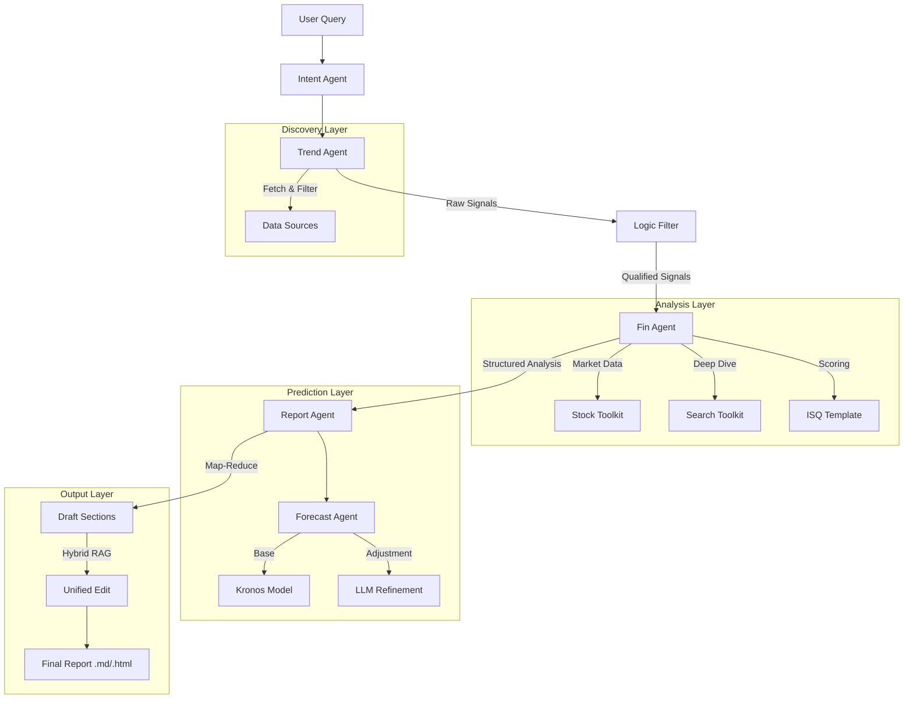

# SignalFlux ｜ 千里耳

<div align="center">
  <p>
    <b>English</b> | <a href="./README_CN.md">简体中文</a>
  </p>
</div>

<div align="center">
  <!-- Logo -->
  
  
  <p>
    An extensible, open-source framework for extracting financial signals from news and social media.
  </p>

  <!-- Badges -->
  
  
  

  <!-- 预留演示内容位置 -->
  <br/><br/>
Click the preview below to see a generated sample report:

[](assets/examples/demo_report.html)

This demo is based on a real-world analysis of a **Fire Safety Regulation Event**, featuring:
1.  **Quick Scan Dashboard**: High-level signal assessment.
2.  **Logic Transmission Chain**: Visualizing causal relationships.
3.  **ISQ Assessment**: Quantitative scoring of signal quality.
4.  **T+N Pricing Game**: Identifying arbitrage windows.
</div>

---

## 📖 Table of Contents
- [When to Use](#-when-to-use)
- [Features](#-features)
- [Example Output](#-example-output)
- [Quick Start](#-quick-start)
- [Architecture](#-architecture)
- [Development Guide](#-development-guide)
- [Roadmap](#-roadmap)
- [Contributing](#-contributing)
- [License](#-license)

---

## 🎯 When to Use

SignalFlux is designed for financial analysts, quantitative researchers, and individual investors who need to bridge the gap between unstructured information and actionable trading signals.

- **Investment Research**: Automate the collection and analysis of fragmented information from social media and news outlets to discover hidden investment opportunities.
- **Market Monitoring**: Real-time tracking of "hot topics" (e.g., policy shifts, industry breakthroughs) and their potential impact on specific sectors or stocks.
- **Quantitative Analysis**: Convert qualitative news into quantitative sentiment scores and signal indicators for backtesting or model input.
- **Report Automation**: Generate professional-grade investment reports with structured logic, charts, and references in seconds.

---

## ✨ Features

- **Multi-Agent Collaboration**: Specialized agents for Trend Spotting, Financial Analysis, and Report Writing working in concert.
- **15+ Data Sources**: Comprehensive coverage including Weibo, Cailian Press, Wall Street News, and more via `NewsToolkit`.
- **Dual-Model Architecture**: Optimized routing between "Reasoning Models" (e.g., GPT-4o) for logic and "Tool Models" (e.g., Qwen/Ollama) for data fetching.
- **Hybrid RAG Engine**: Combines BM25 (keyword) and Vector Search (semantic) for precise information retrieval.
- **Visualized Reports**: Automatically generates Markdown/HTML reports with interactive charts and signal logic graphs.

---

## 🚀 Quick Start

### Prerequisites
- **Python 3.12+**
- **uv** (Recommended for fast package management)

### Installation

1. **Clone the repository**
   ```bash
   git clone https://github.com/your-username/SignalFlux.git
   cd SignalFlux
   ```

2. **Install dependencies**
   ```bash
   uv sync
   ```

### Configuration

1. **Setup Environment Variables**
   Copy the example configuration file:
   ```bash
   cp .env.example .env
   ```

2. **Edit `.env`**
   Open `.env` and fill in your API keys. SignalFlux supports a wide range of providers:
   - `LLM_PROVIDER`: `openrouter`, `openai`, `ollama`, `deepseek`, etc.
   - `REASONING_MODEL_ID`: Model for complex analysis (e.g., `gpt-4o`).
   - `TOOL_MODEL_ID`: Model for tool usage (e.g., `qwen2.5`).

### Run

Execute the main workflow:
```bash
uv run src/main_flow.py
```

#### Command Line Arguments
| Argument | Description | Default |
| :--- | :--- | :--- |
| `--query` | User query/intent (e.g., "A-share tech sector") | `None` |
| `--sources` | News sources: `all`, `financial`, `social`, `tech`, or a comma-separated list | `all` |
| `--wide` | Number of news items to fetch per source | `10` |
| `--depth` | Report depth: `auto` (LLM decided) or an integer limit | `auto` |
| `--template` | ISQ scoring template ID | `default_isq_v1` |
| `--resume` | Resume from the latest checkpoint | `False` |
| `--resume-from` | Checkpoint to resume from: `report` (reuse MD), `analysis` (rerender) | `report` |

The system will start the agent workflow: identifying intent -> fetching trends -> analyzing signals -> predictive modeling -> generating reports. 
Artifacts will be saved in the `reports/` directory.

---

## 🏗 Architecture

SignalFlux follows a layered architecture to decouple tools, agents, and workflow logic.



### Core Components
1.  **Workflow Layer (`main_flow.py`)**: Orchestrates the global state and execution path, supporting checkpoints and resume.
2.  **Agent Layer (`src/agents/`)**:
    *   `TrendAgent`: Scans for hot topics and performs initial sentiment analysis.
    *   `FinAgent`: Validates investment logic, checks stock data, and formulates transmission chains using ISQ templates.
    *   `ForecastAgent`: Integrates time-series models with LLM reasoning for price trend predictions.
    *   `ReportAgent`: Uses a Map-Reduce approach to plan, write, and refine professional reports with interactive charts.
3.  **Infra & Tools (`src/tools/`, `src/utils/`)**:
    *   **Toolkits**: News, Stock, Sentiment, Search.
    *   **Storage**: SQLite for persistence, Vector DB for semantic search.

---

## 🛠 Development Guide

### Project Structure (Key Directories)
```
SignalFlux/
├── config/             # Configuration profiles
├── docs/               # Documentation & Guides
├── reports/            # Generated reports
├── src/
│   ├── agents/         # AI Agents (Trend, Fin, Report, Intent)
│   ├── tools/          # Toolkits (News, Stock, Search)
│   ├── utils/          # Core utilities (LLM factory, DB, Sentiment)
│   └── main_flow.py    # Entry point
├── .env.example        # Environment template
└── pyproject.toml      # Dependency management
```

### Adding a New Data Source
1.  Create a new provider class in `src/tools/news_toolkit/providers/`.
2.  Register the provider in `NewsToolkit`.
3.  Ensure output format matches the standard `NewsItem` schema.

### Testing
Run the test suite using `pytest`:
```bash
uv run pytest src/tests/
```

---

## 🗺 Roadmap

Derived from our internal plans:

### Phase 1: Enhanced Visualization & Signals
- [x] **Semantic Visualization**: Relation topology graphs and ISQ Radar charts.
- [x] **Signal Pipeline**: Quantitative scoring tunnel based on ISQ templates.
- [ ] **Polymarket Integration**: Add prediction market data as a signal source.

### Phase 2: Advanced Inference
- [x] **Time-Series Integration**: Integrated [Kronos](https://github.com/shiyu-coder/Kronos) for predictive K-line modeling.
- [x] **AI Forecasting**: Multi-agent adjustment of historical predictions based on news context.

### Phase 3: Infrastructure & Expansion
- [x] **Hybrid Search**: Reciprocal Rank Fusion of BM25 and Vector Search.
- [ ] **US Market Support**: Add Alpha Vantage/Yahoo Finance adaptors.
- [ ] **LangGraph Migration**: Explore graph-based state management for complex loops.

---

## 🤝 Contributing

Contributions are welcome! Please feel free to verify the `docs/guide.md` for architectural conformance before submitting a Pull Request.

1.  Fork the Project
2.  Create your Feature Branch (`git checkout -b feature/AmazingFeature`)
3.  Commit your Changes (`git commit -m 'Add some AmazingFeature'`)
4.  Push to the Branch (`git push origin feature/AmazingFeature`)
5.  Open a Pull Request

---

## 📄 License

Distributed under the MIT License. See `LICENSE` for more information.