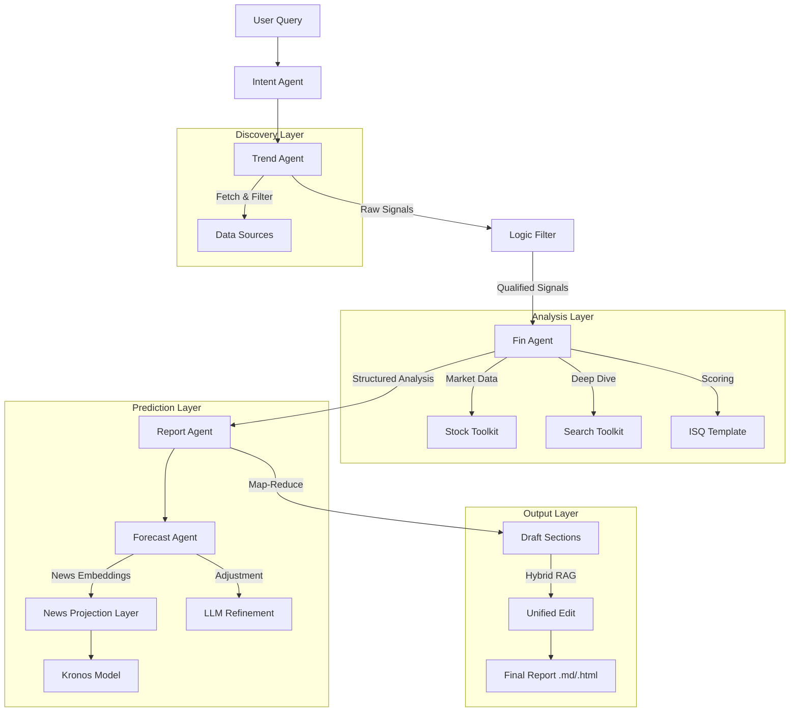

# DeepEar ｜ 顺风耳

<div align="center">
  <p>
    <b>English</b> | <a href="./README_CN.md">简体中文</a>
  </p>
</div>

<div align="center">
  <!-- Logo -->
  
  
  <p>
    An open-source framework for Deep Research and Financial Signal Tracking.
  </p>

  <!-- Badges -->
  
  
  

  [](#option-3-use-as-an-ai-agent-skill)

  <!-- 预留演示内容位置 -->
  <br/><br/>
Click the preview below to see some generated sample reports:

[](https://rkiding.github.io/signalflux/)

</div>

---

## 📖 Table of Contents
- [When to Use](#-when-to-use)
- [Features](#-features)
- [Quick Start](#-quick-start)
- [Architecture](#-architecture)
- [Development Guide](#-development-guide)
- [Roadmap](#-roadmap)
- [Contributing](#-contributing)
- [License](#-license)

---

## 🎯 When to Use

DeepEar is designed for financial analysts, quantitative researchers, and individual investors who need to bridge the gap between unstructured information and actionable trading signals.

- **Investment Research**: Automate the collection and analysis of fragmented information from social media and news outlets to discover hidden investment opportunities.
- **Market Monitoring**: Real-time tracking of "hot topics" (e.g., policy shifts, industry breakthroughs) and their potential impact on specific sectors or stocks.
- **Quantitative Analysis**: Convert qualitative news into quantitative sentiment scores and signal indicators for backtesting or model input.
- **Report Automation**: Generate professional-grade investment reports with structured logic, charts, and references in seconds.

---

## ✨ Features

- **Multi-Agent Collaboration**: Specialized agents for Trend Spotting, Financial Analysis, and Report Writing working in concert.
- **Interactive Fintech Dashboard**: A modern React-based UI for real-time monitoring of agent workflows, logs, and structured results.
- **Logic Evolution Tracking**: Active tracking of how investment theses evolve as new market news and price data arrive.
- **Signal-Based Comparison**: Deep side-by-side analysis of signal changes, drift in sentiment, and logic updates between different runs.
- **15+ Data Sources**: Comprehensive coverage including Weibo, Cailian Press, Wall Street News, and more via `NewsToolkit`.
- **News-Aware Time-Series Model**: Custom **Kronos** integration with a news-projection layer for predicting price shocks.
- **Visualized Reports & Logic Graphs**: High-fidelity HTML reports featuring interactive **Draw.io** diagrams for logic transmission.
- **Hybrid RAG Engine**: Combines BM25 (keyword) and Vector Search (semantic) for precise information retrieval.

---

## 🚀 Quick Start

### Prerequisites
- **Python 3.12+**
- **uv** (Recommended for fast package management)

### Installation

1. **Clone the repository**
   ```bash
   git clone https://github.com/RKiding/DeepEar.git
   cd DeepEar
   ```

2. **Install dependencies**
   ```bash
   uv sync
   ```

### Configuration

1. **Setup Environment Variables**
   Copy the example configuration file:
   ```bash
   cp .env.example .env
   ```

2. **Edit `.env`**
   Open `.env` and fill in your API keys. DeepEar supports a wide range of providers:
   - `LLM_PROVIDER`: `openrouter`, `openai`, `ollama`, `deepseek`, etc.
   - `REASONING_MODEL_ID`: Model for complex analysis (e.g., `gpt-4o`).
   - `TOOL_MODEL_ID`: Model for tool usage (e.g., `qwen2.5`).
   - `JINA_API_KEY`: (Optional) Unified Jina API key for both web search (s.jina.ai) and content extraction (r.jina.ai).

### Running DeepEar

#### Option 1: Start the Dashboard (Recommended)
Launch the modern web interface to monitor and control the agents visually:
```bash
# Initial the frontend (First time only)
cd dashboard/frontend
npm install 
npm run build

# Start the server
uv run python -m dashboard.server
```
Open `http://localhost:8765` in your browser.

<div align="center">
  
  <p><i>Real-time Agent Workflow Monitoring Dashboard</i></p>
</div>

> **Note**: For first-time access, you need to register an account. Use the default invitation code `DEEP-EAR-ADMIN` to get started. You can generate more invitation codes using `uv run scripts/generate_invitation.py`.

#### Option 2: Command Line Interface
Execute the main workflow directly:
```bash
uv run src/main_flow.py
```

#### CLI Command Line Arguments
| Argument | Description | Default |
| :--- | :--- | :--- |
| `--query` | User query/intent (e.g., "A-share tech sector") | `None` |
| `--sources` | News sources: `all`, `financial`, `social`, `tech`, or a comma-separated list | `all` |
| `--wide` | Number of news items to fetch per source | `10` |
| `--depth` | Report depth: `auto` (LLM decided) or an integer limit | `auto` |
| `--template` | ISQ (Investment Signal Quality) scoring template ID | `default_isq_v1` |
| `--concurrency` | Concurrency level for signal analysis (max workers) | `1` |
| `--resume` | Resume from the latest checkpoint | `False` |
| `--resume-from` | Checkpoint to resume from: `report` (reuse MD), `analysis` (rerender) | `report` |
| `--update-from` | Update an existing run (provide base run ID) to track signal evolution | `None` |

The system will start the agent workflow: identifying intent -> fetching trends -> analyzing signals -> predictive modeling -> generating reports. 

Artifacts will be saved in the `reports/` directory.
#### Option 3: Use as an AI Agent Skill
DeepEar can be integrated into various AI agent frameworks (like Antigravity, OpenCode, Claude Code) as a specialized skill. For individual component skills (e.g., news fetchers, sentiment analyzers), please refer to [Awesome-finance-skills](https://github.com/RKiding/Awesome-finance-skills).

1. **Install the Skill**
   Copy the `skills/deepear` directory to your agent's skill folder:
   ```bash
   # Example for OpenCode/Claude Code
   mkdir -p ~/.config/opencode/skills/
   cp -r skills/deepear ~/.config/opencode/skills/
   ```

2. **Skill Installation Paths**

| Framework | Scope | Installation Path |
|:----------|:------|:------------------|
| **Antigravity** | Workspace | `<workspace>/.agent/skills/<skill>/` |
| | Global | `~/.gemini/antigravity/global_skills/<skill>/` |
| **OpenCode** | Project | `.opencode/skills/<skill>/` or `.claude/skills/<skill>/` |
| | Global | `~/.config/opencode/skills/<skill>/` |
| **OpenClaw** | Workspace | `<workspace>/skills` (highest priority) |
| | Managed | `~/.openclaw/skills` |
| **Claude Code / Codex** | Personal | `~/.claude/skills/` or `~/.codex/skills/` |
| | Project | `.claude/skills/` |

3. **Start the Skill Server**
   ```bash
   uv run skills/deepear/scripts/server.py
   ```
   The agent can now use the `analyze` tool to trigger the DeepEar workflow and `status` to check results.

---

## 🏗 Architecture

DeepEar follows a layered architecture to decouple tools, agents, and workflow logic.



### Core Components
1.  **Workflow Layer (`main_flow.py`)**: Orchestrates the global state and execution path, supporting checkpoints and resume.
2.  **Agent Layer (`src/agents/`)**:
    *   `TrendAgent`: Scans for hot topics and performs initial sentiment analysis.
    *   `FinAgent`: Validates investment logic, checks stock data, and formulates transmission chains using ISQ templates.
    *   `ForecastAgent`: Integrates time-series models with LLM reasoning for price trend predictions.
    *   `ReportAgent`: Uses a Map-Reduce approach to plan, write, and refine professional reports with interactive charts.
3.  **Infra & Tools (`src/tools/`, `src/utils/`)**:
    *   **Toolkits**: News, Stock, Sentiment, Search.
    *   **Storage**: SQLite for persistence, Vector DB for semantic search.

---

## 🧠 News-Aware Kronos Model
One of the core innovations in DeepEar is the integration of a **few-shot news-projection layer** into the Kronos foundation model. This allows the system to not just predict based on historical prices, but to understand the quantitative impact of news events.

<div align="center">
  
  <p><i>The news-aware projection mechanism: mapping semantic embeddings to the model's latent space.</i></p>
</div>

- **Projection Layer**: A lightweight linear layer that maps SentenceTransformer embeddings to the hidden state of Kronos.
- **Global Shift**: The projected news bias is added to the hidden representation across all time steps, shifting the model's "latent expectation" before final prediction.
- **Training**: Fine-tuned on a synthetic dataset of historical news-shock pairs verified by LLM reasoning.

---

## 🛠 Development Guide

### Project Structure (Key Directories)
```
DeepEar/
├── config/             # Configuration profiles
├── docs/               # Documentation & Guides
├── reports/            # Generated reports
├── src/
│   ├── agents/         # AI Agents (Trend, Fin, Report, Intent)
│   ├── tools/          # Toolkits (News, Stock, Search)
│   ├── utils/          # Core utilities (LLM factory, DB, Sentiment)
│   └── main_flow.py    # Entry point
├── .env.example        # Environment template
└── pyproject.toml      # Dependency management
```

### Adding a New Data Source
1.  Create a new provider class in `src/tools/news_toolkit/providers/`.
2.  Register the provider in `NewsToolkit`.
3.  Ensure output format matches the standard `NewsItem` schema.

### Testing
Run the test suite using `pytest`:
```bash
uv run pytest src/tests/
```

---

## 🗺 Roadmap

Derived from our internal plans:

### Phase 1: Enhanced Visualization & Signals
- [x] **Semantic Visualization**: Relation topology graphs and ISQ Radar charts.
- [x] **Interactive Dashboard**: Real-time React-based fintech UI for run monitoring.
- [x] **Interactive Diagrams**: Logic transmission chains via **Draw.io**.

### Phase 2: Advanced Inference
- [x] **Time-Series Integration**: Integrated **Kronos** for predictive K-line modeling.
- [x] **News-Aware Projection**: Latent space news impact injection into foundation models.
- [x] **AI Forecasting**: Multi-agent market impact refinement.

### Phase 3: Infrastructure & Automation
- [x] **Hybrid Search**: Reciprocal Rank Fusion of BM25 and Vector Search.
- [x] **Logic Evolution Tracking**: Active monitoring of investment thesis changes over time.
- [x] **Signal-Based Comparison**: Visual diffing of signal sentiment and reasoning across runs.

### Phase 4: Expansion
- [ ] **US Market Support**: Add Alpha Vantage/Yahoo Finance adaptors.
- [ ] **LangGraph Migration**: Graph-based state management for complex loops.
- [ ] **Polymarket Integration**: Add prediction market data as a signal source.


---

## 🤝 Contributing

Contributions are welcome! Please feel free to verify the `docs/guide.md` for architectural conformance before submitting a Pull Request.

1.  Fork the Project
2.  Create your Feature Branch (`git checkout -b feature/AmazingFeature`)
3.  Commit your Changes (`git commit -m 'Add some AmazingFeature'`)
4.  Push to the Branch (`git push origin feature/AmazingFeature`)
5.  Open a Pull Request

---

## 🙏 Acknowledgements

Special thanks to the following projects and communities for their inspiration and core technologies:

- **[Agno](https://github.com/agno-agi/agno)**: For providing the robust multi-agent framework.
- **[Kronos](https://github.com/shiyu-coder/Kronos)**: For the high-performance time-series foundation model.
- **[NewsNow](https://github.com/ourongxing/newsnow)**: For the comprehensive news collection capabilities.
- **[DeepFund](https://github.com/HKUSTDial/DeepFund)**: For the advanced financial analysis methodology and research.

---

## 📜 Citation

If you find this project useful in your research or applications, please consider citing it:

```bibtex
@misc{deep_ear_2026,
  author = {Runke Ruan},
  title = {DeepEar: An Extensible Framework for Financial Signal Extraction and News-Aware Forecasting},
  year = {2026},
  publisher = {GitHub},
  journal = {GitHub Repository},
  howpublished = {\url{https://github.com/rkiding/DeepEar}}
}
```

---

## 📄 License

Distributed under the MIT License. See `LICENSE` for more information.