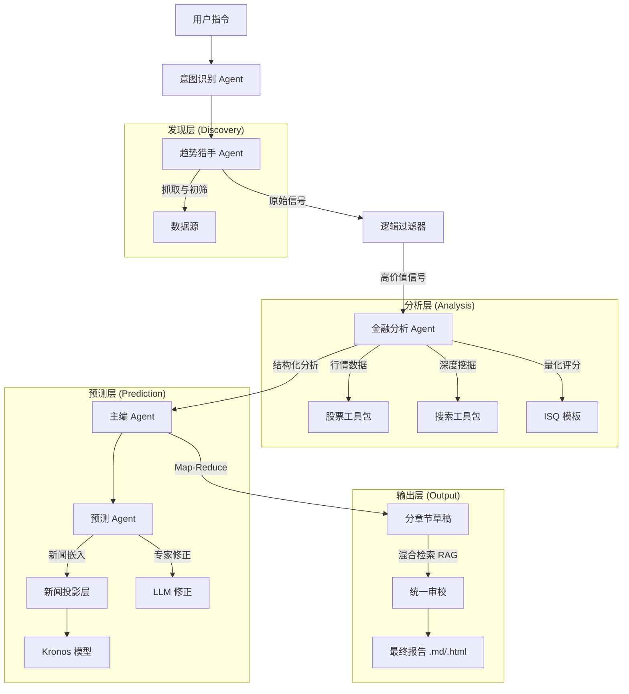

# AlphaEar ｜ 顺风耳

<div align="center">
  <p>
    <a href="./README.md">English</a> | <b>简体中文</b>
  </p>
</div>

<div align="center">
  <!-- Logo -->
  
  
  <p>
    一个可扩展的开源框架，用于从新闻和社交媒体中提取金融信号。
  </p>

  <!-- Badges -->
  
  
  

  <!-- 预留演示内容位置 -->
  <br/><br/>
  <!--  -->
  点击下方预览图查看生成的研报样例：

[](https://rkiding.github.io/signalflux/)

</div>

---

## 📖 目录
- [适用场景](#-适用场景)
- [核心特性](#-核心特性)
- [演示报告](#-演示报告)
- [快速开始](#-快速开始)
- [系统架构](#-系统架构)
- [开发指南](#-开发指南)
- [路线图](#-路线图)
- [如何贡献](#-如何贡献)
- [开源协议](#-开源协议)

---

## 🎯 适用场景

AlphaEar 专为金融分析师、量化研究员和个人投资者设计，旨在弥合非结构化信息与可操作交易信号之间的鸿沟。

- **投研自动化**: 自动收集和分析来自社交媒体与新闻媒体的碎片化信息，发现隐藏的投资机会。
- **市场监控**: 实时跟踪“热点话题”（如政策转向、技术突破）及其对特定板块或个股的潜在影响。
- **量化分析**: 将定性的新闻资讯转化为定量的“情感得分”和“信号指标”，用于回测或模型输入。
- **研报生成**: 秒级生成具备结构化逻辑、可视化图表和引用来源的专业投资研报。

---

## ✨ 核心特性

- **多智能体协作**: 具备趋势发现、金融分析和研报撰写专长的智能体协同工作。
- **全网数据覆盖**: 通过 `NewsToolkit` 接入微博、财联社、华尔街见闻等 15+ 核心数据源。
- **引入新闻感知的时序模型**: 基于 **Kronos** 结合新闻投影层，实现对股价冲击的量化预测。
- **可视化研报与逻辑图**: 生成包含交互式 **Draw.io** 逻辑传导图的高质量 HTML 研报。
- **双模型路由架构**: 优化路由机制，将复杂逻辑交给“推理模型”（如 GPT-5.2），将数据获取交给“工具模型”（如 Ollama）。
- **混合检索引擎**: 结合 BM25（关键词匹配）和向量搜索（语义匹配），实现精准的信息召回。

---

## 🚀 快速开始

### 前置要求
- **Python 3.12+**
- **uv** (推荐使用 uv 进行极速包管理)

### 安装步骤

1.  **克隆仓库**
    ```bash
    git clone https://github.com/your-username/AlphaEar.git
    cd AlphaEar
    ```

2.  **安装依赖**
    ```bash
    uv sync
    ```

### 配置

1.  **设置环境变量**
    复制示例配置文件：
    ```bash
    cp .env.example .env
    ```

2.  **编辑 `.env`**
    填入你的 API Keys。AlphaEar 支持多种模型提供商：
    - `LLM_PROVIDER`: `openrouter`, `openai`, `ollama`, `deepseek` 等。
    - `REASONING_MODEL_ID`: 用于复杂分析的模型 (推荐 `gpt-4o`)。
    - `TOOL_MODEL_ID`: 用于工具调用的模型 (推荐 `qwen2.5`)。
    - `JINA_API_KEY`: (可选) 统一的 Jina API Key，同时支持搜索 (s.jina.ai) 和内容提取 (r.jina.ai)。

### 运行

执行主工作流：
```bash
uv run src/main_flow.py
```

#### 命令行参数说明
| 参数 | 说明 | 默认值 |
| :--- | :--- | :--- |
| `--query` | 用户查询意图 (如 "A股科技板块") | `None` |
| `--sources` | 新闻来源: `all`, `financial`, `social`, `tech`, 或以逗号分隔的列表 | `all` |
| `--wide` | 每个来源抓取的新闻条数 | `10` |
| `--depth` | 报告深度: `auto` (由 LLM 判断) 或整数限制 | `auto` |
| `--template` | ISQ 评分模板 ID | `default_isq_v1` |
| `--resume` | 从最近的断点恢复运行 | `False` |
| `--resume-from` | 恢复位置: `report` (仅重绘 MD), `analysis` (重新生成信号分析) | `report` |

系统将启动智能体工作流：识别意图 -> 抓取热点 -> 分析信号 -> 时序预测建模 -> 生成报告。
生成的产物将保存在 `reports/` 目录下。

---

## 🏗 系统架构

AlphaEar 采用分层架构设计，确保工具、智能体与工作流逻辑的解耦。



## 🧠 新闻感知 Kronos 模型
AlphaEar 的核心创新之一是在 Kronos 基础模型中集成了**少样本新闻投影层 (few-shot news-projection layer)**。这使得系统不仅能基于历史价格进行预测，还能理解新闻事件对市场的量化冲击。

<div align="center">
  
  <p><i>新闻感知投影机制：将语义嵌入映射到模型的潜空间。</i></p>
</div>

- **投影层 (Projection Layer)**: 一个轻量级的线性层，将 SentenceTransformer 嵌入映射到 Kronos 的隐状态空间。
- **全局偏置 (Global Shift)**: 投影后的新闻偏置被加到所有时间步的隐层表示中，在最终预测前改变模型的“潜意图”。
- **模型训练**: 在经过 LLM 验证的“新闻-波动”对合成数据集上进行微调。

---

### 核心组件
1.  **工作流层 (`main_flow.py`)**: 负责全局状态管理与执行路径编排，支持断点续传（Checkpoints）。
2.  **智能体层 (`src/agents/`)**:
    *   `TrendAgent`: 扫描热点话题并进行初步的情感/热度分析。
    *   `FinAgent`: 验证投资逻辑，查询股价数据，通过 ISQ 模板构建传导链条。
    *   `ForecastAgent`: 结合时序预测模型与 LLM 推理，对股价趋势进行预测。
    *   `ReportAgent`: 采用 Map-Reduce 模式规划、撰写并精修包含交互式图表的专业研报。
3.  **基础设施 (`src/tools/`, `src/utils/`)**:
    *   **Toolkits**: 新闻、股票、情感分析、搜索。
    *   **存储**: SQLite 用于持久化，向量数据库用于语义检索。

---

## 🛠 开发指南

### 项目结构
```
AlphaEar/
├── config/             # 预设配置文件
├── docs/               # 文档与指南
├── reports/            # 生成的报告
├── src/
│   ├── agents/         # AI 智能体 (Trend, Fin, Report, Intent)
│   ├── tools/          # 工具包 (News, Stock, Search)
│   ├── utils/          # 核心工具 (LLM工厂, DB, Sentiment)
│   └── main_flow.py    # 入口文件
├── .env.example        # 环境变量模板
└── pyproject.toml      # 依赖管理配置
```

### 添加新的数据源
1.  在 `src/tools/news_toolkit/providers/` 下创建新的 provider 类。
2.  在 `NewsToolkit` 中注册该 provider。
3.  确保输出格式符合标准的 `NewsItem` schema。

### 测试
使用 `pytest` 运行测试套件：
```bash
uv run pytest src/tests/
```

---

## 🗺 路线图 (Roadmap)

基于内部规划整理：

### 第一阶段：增强可视化与信号质量
- [x] **语义可视化**: 关联拓扑图 (Transmission Graph) 与 ISQ 雷达图。
- [x] **交互式图表**: 使用 **Draw.io** (MxGraph) 生成可编辑、专业的逻辑传导链。
- [x] **信号漏斗**: 基于 ISQ 模板的量化评分筛选通道。

### 第二阶段：高阶推理
- [x] **时序模型集成**: 已接入 **Kronos** 进行预测 K 线建模。
- [x] **新闻感知投影**: 训练了用于注入新闻冲击语义的线性投影层。
- [x] **AI 预测修正**: 多智能体协同基于新闻背景修正时序预测及其归因。

### 第三阶段：基础设施升级
- [x] **混合检索升级**: 实现基于 RRF 的 BM25 与向量搜索融合检索。
- [ ] **美股支持**: 增加 Alpha Vantage/Yahoo Finance 适配器。
- [ ] **LangGraph 迁移**: 探索图结构状态管理以处理更复杂的循环逻辑。
- [ ] **Polymarket 集成**: 引入预测市场数据作为信号源。

---

## 🤝 如何贡献

欢迎提交 Pull Reqeust！在提交代码前，请确保查阅 `docs/guide.md` 以了解架构规范。

1.  Fork 本项目
2.  创建 Feature 分支 (`git checkout -b feature/CoolFeature`)
3.  提交更改 (`git commit -m 'Add some CoolFeature'`)
4.  推送到分支 (`git push origin feature/CoolFeature`)
5.  发起 Pull Request

---

## 🙏 致谢

特别感谢以下项目和社区提供的灵感与核心技术支持：

- **[Agno](https://github.com/agno-agi/agno)**: 提供强大的多智能体协作框架。
- **[Kronos](https://github.com/shiyu-coder/Kronos)**: 提供高性能的时间序列基础模型。
- **[NewsNow](https://github.com/ourongxing/newsnow)**: 提供全方位的新闻数据抓取能力。
- **[DeepFund](https://github.com/HKUSTDial/DeepFund)**: 提供先进的金融分析方法论与研究支持。

---

## 📜 引用

如果您觉得这个项目对您的研究或应用有所帮助，请考虑引用：

```bibtex
@misc{alpha_ear_2026,
  author = {Runke Ruan},
  title = {AlphaEar: An Extensible Framework for Financial Signal Extraction and News-Aware Forecasting},
  year = {2026},
  publisher = {GitHub},
  journal = {GitHub Repository},
  howpublished = {\url{https://github.com/rkiding/AlphaEar}}
}
```

---

## 📄 开源协议

本项目采用 MIT 协议开源。详情请见 `LICENSE` 文件。
